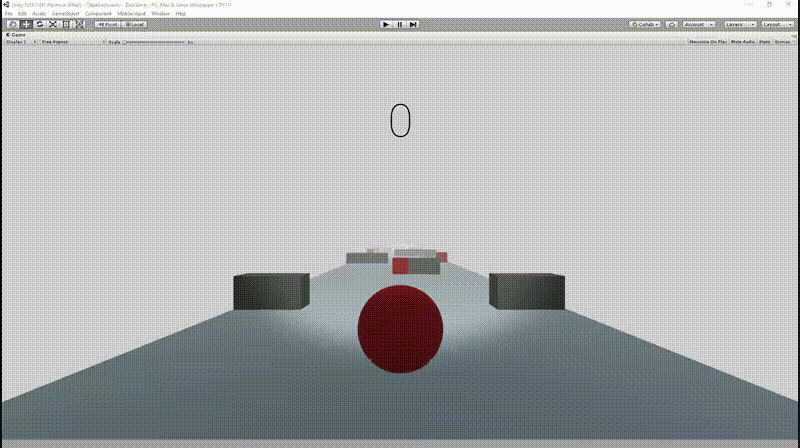
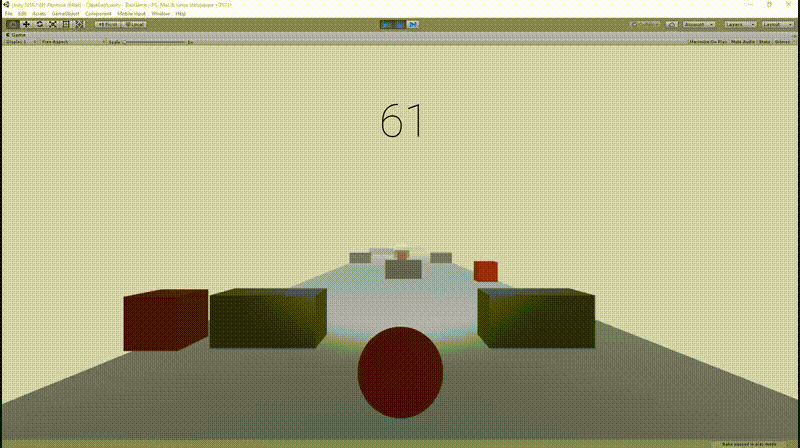
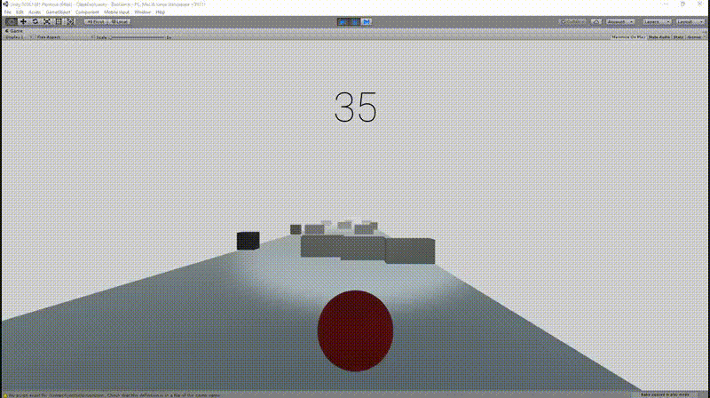

# Delegados-Eventos

- Crear un escenario básico para la escena del proyecto para la evaluación final.
- Agregar dos tipos de GameObject de los que haya varias instancias en la escena.
- Implementar un controlador de escena usando el patrón delegado que gestione las siguientes acciones:
    -   Si el jugador choca con un objeto de tipo A se incrementa su poder.
    -   Si el jugador choca con objetos de tipo B, todos los de ese tipo sufrirán alguna transformación o algún cambio en su apariencia y decrementarán el poder del jugador.
- Incorporar un elemento que sirva para encender o apagar un foco utilizando el teclado.

---

### Proyecto

- Se ha realizado un juego simple en donde una bola se mueve sobre una superficie plana esquivando obstaculos.
- La bola tiene una velocidad fija, hacia adelante, y dos laterales, utilizadas con las teclas 'a' y 'd'.
- Al chocar la bola con los obstaculos de color rojo se reduce la velocidad de esta y los obstaculos cambian de color, alternando entre negro y rojo.
- Al contrario, cuando la bola choca con los obstaculos grises la bola aumentará su velocidad ("poder").
- También se ha añadido un foco que simula los faros de un coche, el cual se puede encender y apagar con las flechas "up" y "down".
---

---
- Si la bola cae por un lado de la pista perderá el juego.

- Si por el contrario llegá la final de los obstaculos ganará.
----

----